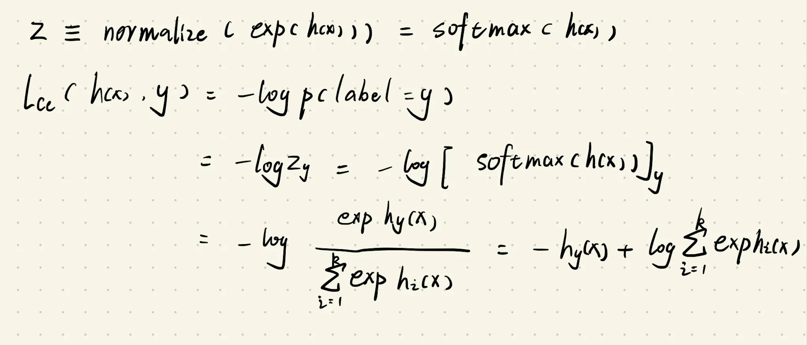

# **Question 3: Softmax loss**

loss的理解有很多
- 差异程度
- 将分布1变成分布2的困难程度
- 分布1取到y的概率的倒数


预测概率结果为z
$$
\begin{equation}\ell_{\mathrm{softmax}}(z, y) = \log\sum_{i=1}^k \exp z_i - z_y.\end{equation}
$$
简单来讲就是结合了softmax函数和-log交叉熵损失函数

> 为了避免数字过大溢出，可以同时减去一个数字（通常是原一串数字里最大的），不影响最终结果（因为是指数运算，常数可以提出去）
>
> 这样$e^{z\_i}$不会太大




``` python
def softmax_loss(Z, y):
    Z_y = Z[np.arange(Z.shape[0]), y] # 取真实标签的预测值, 取出所有z_y
    Z_sum = np.log(np.exp(Z).sum(axis=1))
    return np.mean(Z_sum-Z_y)
def softmax(x):
	return np.exp(x-np.max(x))/np.sum(np.exp(x-np.max(x)),axis=-1).reshape(-1,1)
def softmax_loss(Z, y):
	return np.mean(-np.log(softmax(Z)[np.indices(y.shape)[0], y]))#对应公式推导前两行思路
```

# **Question 4: Stochastic gradient descent for softmax regression**

优化问题(机器学习中的核心问题)

$$
minimize_{}
$$